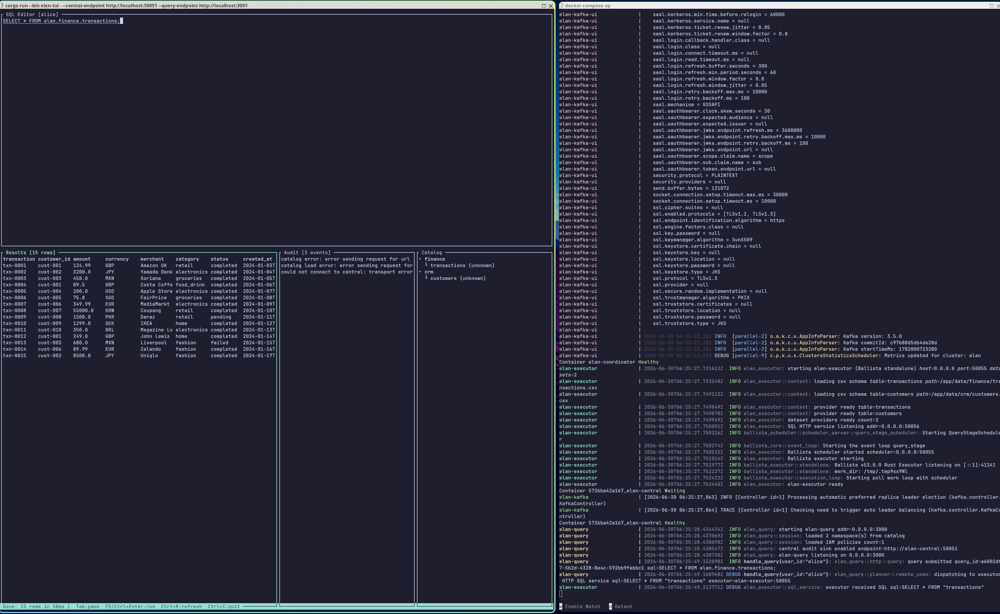

# elan — Federated Query System


A proof-of-concept for federated querying across multiple organisations' data stores, built on [Apache DataFusion](https://datafusion.apache.org/).



## What it does

You register datasets (CSV, Parquet, or Postgres tables) that live in different "environments" (organisations, regions, teams). elan lets you query across them using SQL from a single endpoint, with IAM/RBAC controlling who can see what.

```
POST /api/v1/query
{ "sql": "SELECT c.name, SUM(t.amount) FROM finance.transactions t JOIN crm.customers c ON t.customer_id = c.customer_id GROUP BY c.name" }
```

---

## Architecture

```
                       ┌──────────────────────────────────┐
                       │           elan-central            │
                       │  catalog + IAM + audit (gRPC)     │
                       │  SQLite-backed                    │
                       └──────┬──────────────┬────────────┘
                              │              │
              ┌───────────────┘              └──────────────────┐
              │                                                 │
    ┌─────────▼──────────┐                        ┌────────────▼──────────┐
    │  elan-coordinator  │                        │     elan-executor     │
    │  infers schema from│   ─── remote env ───   │  HTTP SQL service     │
    │  local data files  │                        │  runs DataFusion      │
    │  registers dataset │                        │  against local data   │
    │  + schema to       │                        └───────────────────────┘
    │  elan-central      │                                    ▲
    └────────────────────┘                                    │ POST /sql → Arrow IPC
                                                              │
    ┌───────────────────────────┐              ┌─────────────┴──────────┐
    │        elan-tui           │◄─── HTTP ───►│      elan-query        │
    │  SQL editor (ratatui)     │              │  DataFusion planning   │
    │  result table             │              │  IAM enforcement       │
    │  audit log                │              │  fan-out to executors  │
    │  catalog browser          │              └────────────────────────┘
    └───────────────────────────┘                            │
                        ▲                                    │ gRPC publish_event
                        │ gRPC stream_audit_events           ▼
                        └──────────────────── elan-central audit service
```

### Deployment topology

The components split into two groups:

**Central infrastructure** — `elan-central` and `elan-query` are deployed together. Users and tooling interact with `elan-query`'s HTTP API. `elan-central` is the persistent authority for the catalog, IAM policies, and the audit log.

**Remote environments** — `elan-coordinator` and `elan-executor` are deployed wherever the data lives (another org, another region, another team's infrastructure). Each environment has one coordinator and one executor.

| Service            | Port(s)                       | Role                                      |
| ------------------ | ----------------------------- | ----------------------------------------- |
| `elan-central`     | `50051` (gRPC), `8080` (HTTP) | Catalog, IAM, audit authority             |
| `elan-coordinator` | `8081` (HTTP)                 | Remote environment — registers datasets   |
| `elan-executor`    | `50056` (HTTP SQL)            | Remote environment — executes SQL locally |
| `elan-query`       | `3000` (HTTP)                 | Query entry point, DataFusion planner     |
| `elan-tui`         | —                             | Terminal UI (runs on the user's machine)  |

---

## How queries execute

1. A user sends SQL to `elan-query` via HTTP (`POST /api/v1/query`).
2. `elan-query` looks up its cached dataset catalog (populated from `elan-central` at startup and refreshed every 30 seconds).
3. DataFusion plans the SQL. For each table reference in the plan, a `RemoteTableScanExec` node is produced — it knows the executor endpoint for that dataset.
4. The IAM optimizer rule runs over the plan: datasets the user cannot access are replaced with `EmptyExec` (zero rows); row-level filters are prepended where applicable.
5. Each `RemoteTableScanExec` POSTs the SQL for its dataset to the executor's HTTP SQL service (`POST http://{executor}:50056/sql`). The executor runs DataFusion locally against the real file and returns an Arrow IPC stream.
6. `elan-query` decodes the Arrow IPC stream and assembles the final result for the user.

Joins across namespaces (e.g. `crm.customers` on executor A joined with `finance.transactions` on executor B) are executed by pulling both result sets to `elan-query` and completing the join there in DataFusion.

---

## How datasets are registered

1. The coordinator reads its local config file listing datasets (CSV, Parquet, etc.).
2. At startup, for each dataset, it opens the actual file and infers the full Arrow schema (column names and types) using DataFusion.
3. It sends a `RegisterDataset` gRPC call to `elan-central` with the dataset name, namespace, executor endpoint, inferred schema (as Arrow IPC bytes), and source metadata.
4. `elan-central` stores everything in SQLite. `elan-query` picks up the new dataset on its next 30-second catalog refresh — no restart required.

---

## Audit events

Every query execution is recorded as an audit event. The flow:

1. `elan-query` publishes the event directly to `elan-central` via gRPC (`AuditService/PublishEvent`).
2. `elan-central` stores the event in SQLite and broadcasts it on an in-memory channel.
3. Any connected TUI or subscriber receives it immediately via `AuditService/StreamAuditEvents`.

---

## IAM / RBAC

Access control is enforced at two levels:

**Catalog filter** — `SchemaProvider::table()` returns `None` for datasets the requesting user cannot access. Table existence is concealed from unauthorised users.

**Physical optimizer rule** — `IamFilterRule` traverses the DataFusion physical plan after it is built. For each `RemoteTableScanExec` node it checks the policy engine:

- **Deny** → replaces the node with `EmptyExec` (correct schema, zero rows)
- **Allow + row filter** → prepends a `FilterExec` over the scan
- **Allow** → passes through unchanged

Policies are stored in `elan-central`'s SQLite database. Auth for the query API uses `Authorization: Bearer <username>` (username-as-token for PoC; swap with JWT in production).

Manage policies via the gRPC `IamService`:

```bash
CENTRAL=localhost:50051

# Grant a user access to the finance namespace
grpcurl -plaintext -d '{
  "policy": {
    "subject_type": "USER",
    "subject_id": "alice",
    "resource_namespace": "finance",
    "resource_name": "*",
    "action": "SELECT",
    "effect": "ALLOW",
    "priority": 100
  }
}' $CENTRAL elan.IamService/CreatePolicy

# List all policies
grpcurl -plaintext $CENTRAL elan.IamService/ListPolicies
```

---

## Quick start — Docker

### Prerequisites

- Docker + Docker Compose v2
- Rust toolchain (for `elan-tui` — it runs on your host machine)

### 1. Build and start

```bash
docker compose build
docker compose up
```

This starts:

- `elan-central` (catalog + IAM + audit)
- `elan-coordinator` (registers sample datasets from `data/`)
- `elan-executor` (serves those datasets locally)
- `elan-query` (HTTP query API)

The first build takes a few minutes. Subsequent builds reuse the BuildKit cache.

### 2. Verify everything is up

```bash
curl http://localhost:8080/health      # elan-central
curl http://localhost:3001/health      # elan-query

curl http://localhost:3001/api/v1/catalog | jq .   # registered datasets
```

### 3. Run a query

```bash
# Simple scan
curl -s -X POST http://localhost:3001/api/v1/query \
  -H "Content-Type: application/json" \
  -H "Authorization: Bearer alice" \
  -d '{"sql": "SELECT * FROM elan.finance.transactions LIMIT 5"}' | jq .

# Cross-namespace join
curl -s -X POST http://localhost:3001/api/v1/query \
  -H "Content-Type: application/json" \
  -H "Authorization: Bearer alice" \
  -d '{
    "sql": "SELECT c.name, c.country, COUNT(t.transaction_id) AS tx_count, SUM(t.amount) AS total FROM elan.finance.transactions t JOIN elan.crm.customers c ON t.customer_id = c.customer_id GROUP BY c.name, c.country ORDER BY total DESC"
  }' | jq .
```

### 4. Launch the TUI

The TUI runs on your local machine and connects to the query service over HTTP:

```bash
cargo run -p elan-tui -- \
  --central-endpoint http://localhost:50051 \
  --query-endpoint   http://localhost:3001
```

TUI keybindings:

| Key                  | Action                                           |
| -------------------- | ------------------------------------------------ |
| `Tab`                | Switch pane (editor / results / audit / catalog) |
| `F5` or `Ctrl+Enter` | Execute query                                    |
| `Ctrl+C`             | Quit                                             |
| `↑ / ↓`              | Scroll results or audit log                      |
| `Ctrl+L`             | Clear SQL editor                                 |
| `Ctrl+R`             | Refresh catalog                                  |

---

## Sample data

Two datasets ship in `data/`:

**`crm.customers`** — 10 customers across 10 countries with tier classifications.

**`finance.transactions`** — 15 transactions referencing those customers, with amount, currency, merchant, category, and status.

```sql
-- Gold-tier customers
SELECT * FROM elan.crm.customers WHERE tier = 'gold'

-- Total spend by country (completed transactions only)
SELECT c.country, SUM(t.amount) AS total
FROM elan.finance.transactions t
JOIN elan.crm.customers c ON t.customer_id = c.customer_id
WHERE t.status = 'completed'
GROUP BY c.country
ORDER BY total DESC

-- Failed transactions
SELECT t.transaction_id, c.name, t.amount, t.currency, t.merchant
FROM elan.finance.transactions t
JOIN elan.crm.customers c ON t.customer_id = c.customer_id
WHERE t.status != 'completed'
```

---

## Adding a new dataset

1. Add a `[[datasets]]` block to the coordinator config:

```toml
[[datasets]]
type       = "csv"
name       = "orders"
namespace  = "ops"
path       = "/data/ops/orders.csv"
has_header = true
```

2. Restart the coordinator. It infers the Arrow schema from the file and registers the dataset with `elan-central`. `elan-query` picks it up within 30 seconds (no restart needed).

3. Grant access via `IamService/CreatePolicy` and query:

```sql
SELECT * FROM elan.ops.orders LIMIT 10
```

---

## Local development (without Docker)

### Prerequisites

- Rust 1.82+
- `sqlx-cli`: `cargo install sqlx-cli --features sqlite`

### 1. Database setup

```bash
export DATABASE_URL="sqlite:///$(pwd)/elan_central.db"
sqlx database create
sqlx migrate run --source migrations/
```

### 2. Start services (separate terminals)

```bash
# Terminal 1 — central catalog
cargo run -p elan-central -- --config config/central.toml

# Terminal 2 — coordinator (registers sample datasets)
cargo run -p elan-coordinator -- --config config/coordinator.example.toml

# Terminal 3 — executor
cargo run -p elan-executor -- --config config/executor.toml

# Terminal 4 — query service
cargo run -p elan-query -- --config config/query.toml

# Terminal 5 — TUI
cargo run -p elan-tui -- \
  --central-endpoint http://localhost:50051 \
  --query-endpoint   http://localhost:3001
```

`DATABASE_URL` only needs to be set at **compile time** (for `sqlx::migrate!` macro path resolution). At runtime the path comes from the config file.

```bash
DATABASE_URL="sqlite:///$(pwd)/elan_central.db" cargo build --workspace
```

---

## Key dependencies

| Crate          | Version | Notes                              |
| -------------- | ------- | ---------------------------------- |
| `datafusion`   | `53`    | Query planning and local execution |
| `arrow-*`      | `58`    | Derived from datafusion 53         |
| `tonic`        | `0.12`  | gRPC (workspace-wide)              |
| `ratatui`      | `0.29`  | TUI framework                      |
| `tui-textarea` | `0.7`   | Must match ratatui 0.29            |
