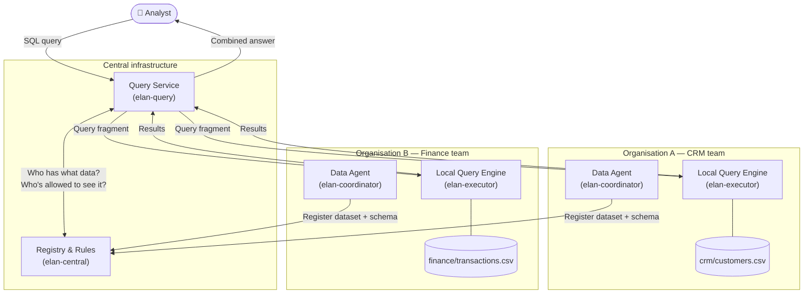
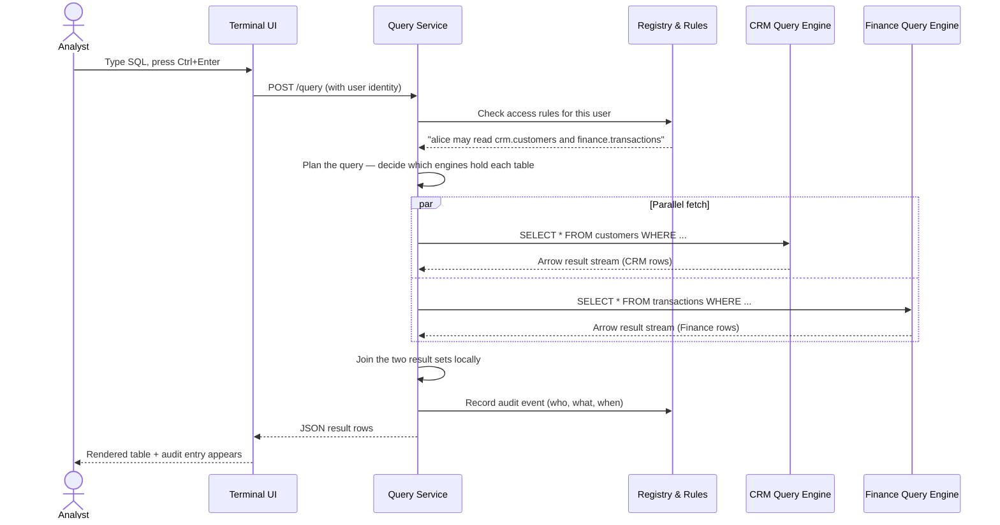
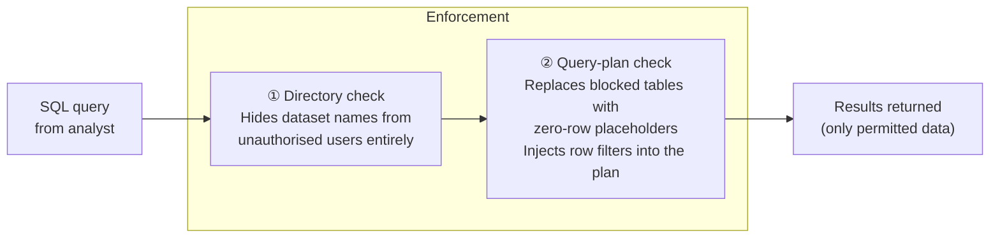
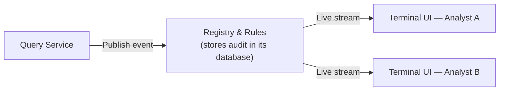

# elan — Stakeholder Tour

This document walks through what elan does, why it exists, and what the proof-of-concept demonstrates — without assuming a technical background.

---

## The problem it solves

Organisations increasingly hold data across multiple teams, divisions, or partner organisations. Each group controls their own data — it lives in their own systems, on their own infrastructure — and they're not willing (or permitted) to hand it all over to a central data warehouse.

Yet business questions span all of that data:

> *"Which of our shared customers had transactions over £500 last quarter?"*
> *"Which product categories are growing in markets where our CRM shows silver-tier customers?"*

Today, answering those questions means either copying data to a central place (slow, expensive, raises data-sovereignty concerns) or building bespoke integrations between teams (brittle, doesn't scale).

**elan takes a different approach: bring the query to the data, not the data to the query.**

---

## The core idea

Each organisation or team runs a small **data agent** (a lightweight service) alongside their data. The agent knows what data it holds and can answer SQL questions about it locally.

A shared **query service** sits in the middle. When a user submits a query, the query service:

1. Figures out which agents hold the relevant data
2. Sends each agent only the part of the query relevant to it
3. Combines the results and returns the answer

The raw data never leaves the organisation that owns it.



---

## What lives where

| Component | Deployed by | What it does |
|---|---|---|
| **Registry & Rules** (`elan-central`) | Central team | Keeps the directory of all registered datasets, access rules, and the audit log |
| **Query Service** (`elan-query`) | Central team | Accepts SQL from users, plans the query, fans out to data agents, returns results |
| **Data Agent** (`elan-coordinator`) | Each data owner | Reads local data files, infers their structure, and advertises them to the central registry |
| **Local Query Engine** (`elan-executor`) | Each data owner | Sits next to the data, receives query fragments, runs them locally, returns only the results |
| **Terminal UI** (`elan-tui`) | Analyst's machine | SQL editor, results viewer, live audit log, and dataset browser |

The data agents and local query engines are deployed **inside each organisation's own infrastructure**. Only query results travel to the central service — not the underlying data files.

---

## How a query flows

Here is the full journey of a single query from the moment an analyst presses execute:



The join happens inside the Query Service using only the result rows — the raw data files are never transferred.

---

## Access control

Every dataset is governed by **access rules** stored in the central registry. Rules are flexible:

- **Allow / Deny** a named user or group access to a dataset or an entire data domain
- **Row-level filtering** — e.g. "alice can only see transactions where `country = 'GB'`"
- **Column masking** *(planned)* — redact sensitive fields (e.g. replace a salary column with `NULL`) for users who should see the row but not that value

Access is enforced in two places:



A user who lacks access to a dataset cannot even tell it exists — the query planner hides it at the name-lookup stage before any data is touched.

---

## The audit trail

Every query — successful or denied — is recorded automatically. The audit entry captures:

- **Who** submitted the query (user identity from the bearer token)
- **What** they asked (the SQL text)
- **When** it ran
- **Whether** access was granted or denied, and for which datasets

In the terminal UI, the audit log panel updates in real time as queries are submitted by any connected user.



Multiple users can be connected simultaneously; all of them see a shared, live feed of activity.

---

## Schema discovery

When a data agent starts up, it doesn't just announce that a dataset exists — it opens the actual data files, reads the column names and data types, and registers that structure with the central registry.

This means the query service knows the full shape of every dataset before any query is submitted, without ever reading the data itself. The registry becomes a searchable catalogue of what data is available, where it lives, and what its structure looks like.

New datasets added to a data agent's configuration are picked up automatically — the central query service refreshes its catalogue every 30 seconds with no manual intervention required.

---

## What the PoC demonstrates

The proof-of-concept ships with two sample datasets representing two different organisational domains:

**CRM domain** — customer records (name, country, tier)
**Finance domain** — transaction records (amount, currency, merchant, category, status)

These simulate data held by two separate teams with their own infrastructure.

### Queries you can run today

**Browse a single domain**
```sql
SELECT * FROM elan.crm.customers WHERE tier = 'gold'
```

**Cross-domain join** — a query that only makes sense if both organisations participate
```sql
SELECT
    c.name,
    c.country,
    SUM(t.amount)   AS total_spend,
    COUNT(*)        AS transaction_count
FROM elan.finance.transactions t
JOIN elan.crm.customers c ON t.customer_id = c.customer_id
WHERE t.status = 'completed'
GROUP BY c.name, c.country
ORDER BY total_spend DESC
```

**Access-controlled view** — if a user's access rule includes a row filter (e.g. `country = 'GB'`), this query automatically returns only the permitted rows, with no change to the SQL the analyst writes:
```sql
SELECT * FROM elan.finance.transactions
```

### What the terminal UI looks like

The TUI has four panels navigated with `Tab`:

| Panel | Contents |
|---|---|
| **Editor** | SQL input — press `Ctrl+Enter` or `F5` to run |
| **Results** | Tabular output with scrolling |
| **Audit log** | Live feed of all queries submitted by any user |
| **Catalogue** | Tree of all registered datasets and their columns |

---

## What comes next

This PoC establishes the core federation, access control, and audit mechanics. The main areas earmarked for further development are:

| Area | Description |
|---|---|
| **Column masking** | Redact individual fields for users with partial access |
| **Real authentication** | Replace the simple username token with JWT / OIDC |
| **Web UI** | Replace the terminal UI with a browser-based query builder |
| **More source types** | Postgres databases and Delta Lake tables alongside CSV/Parquet |
| **Encrypted transport** | TLS on all inter-service communication |
| **Production deployment** | Kubernetes manifests and Helm chart for central and remote components |

A full list of planned work is in [TODO.md](TODO.md).
